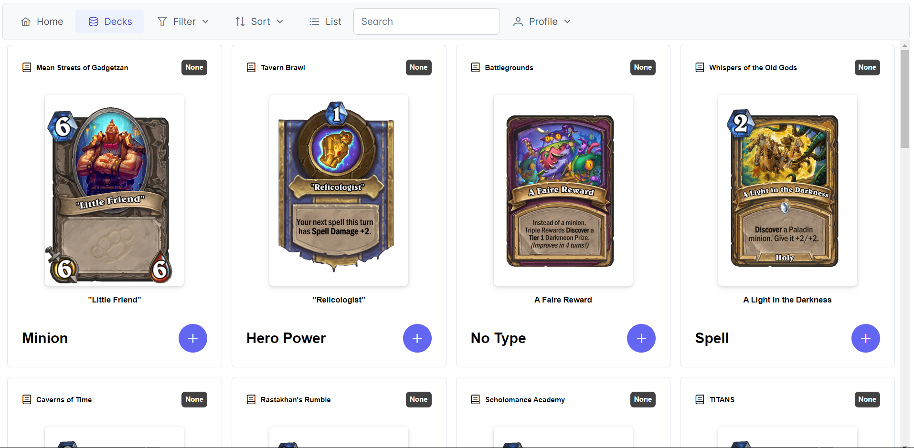
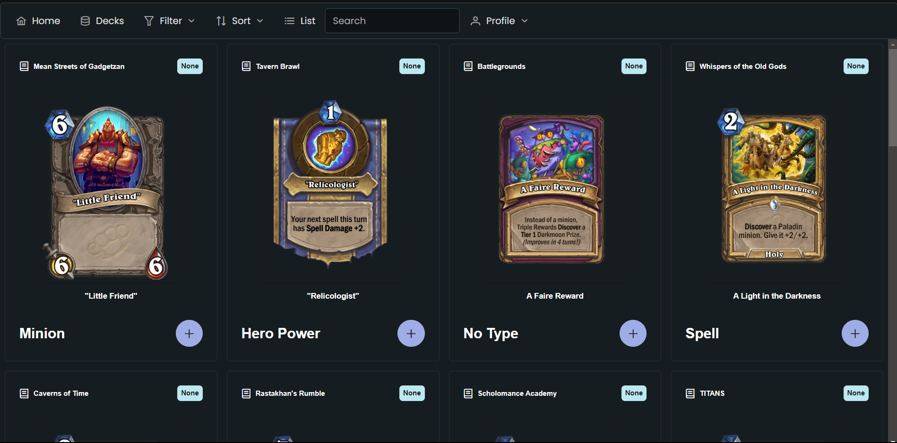

# Deckbuilder

[[_TOC_]]

## Concept


This project is a deckbuilding application for the digital collectible card game Hearthstone. In the game, users can get different cards and build decks using them. Our application makes designing such decks significantly easier and gives the users access to all cards so they can design their dream decks!

The database has been created by scraping the [Hearthstone API](https://hearthstoneapi.com/) before using a custom Python script to clean the data. The main page loads different cards for the user to look at and add to their decks by hittng the plus button. The users can filter and search for cards to find the card they're looking for. Users may also click on a card to get more info about it.

In the /decks page, users can look at their decks, create new decks and delete decks. They can also see what cards are in a specific deck by clicking on it. To access this page, users must be authenticated. If a user is not authenticated they're redirected to the login page. Here they can either log in or hit the "create account" link to create their own account. Users are then stored in the database with their password hashed and we return a JWT token to the user that is stored in their localstorage and is valid for 2 hours.

The project's styling mostly comes from the component library PrimeReact and we use PrimeFlex as our utility library. PrimeFlex is very similar to Tailwind which is why the syntax will probably be familiar to a lot of people.

## How to run the frontend locally

The project assumes the user has Node v.20.6.0 or higher. The client is set up to automatically use the backend and database from the virtual machine. This means you can simply run the client and avoid having to boot the server at all! If you prefer to host the server and database locally however you can of course do so.

After cloning the project you should run the command `npm i` in [our root folder.](/../../) before navigating to the [the client directory.](/client) You also have to run `npm i` in this client folder to get all required dependencies. Finally, just write 'npm run dev' in the client folder and you're done!

## Folder structure

In [client/src](/client/src) components are naturally placed into the [components](/client/src/components/) folder. Components are reusable pieces and are not used to construct their own page. In our case, [CardView](/client/src/components/CardView.tsx) is an essential component that renders [CardItem](/client/src/components/CardItem.tsx) components.

[App.tsx](/client/src/App.tsx) is used for routing between pages and isn't really a page on its own. That's why it's not within the pages folder. This file is useful to visit if you wonder how routing works in this project and also to see how we wrap different providers. For instance, you will find our authentication provider and our Redux store provider here.

[Services](/client/src/service/) are used to help other components, pages etc. For instance [CardService.tsx](/client/src/service/CardService.tsx) is a service for conducting card queries and [RequireAuth](/client/src/service/RequireAuth.tsx) is a wrapper used in [App.tsx](/client/src/App.tsx) for pages like /decks that require users to be authenticated to access. The RequireAuth wrapper automatically checks whether users are authenticated when they attempt to such pages and redirect them to the login page if they are not. This is especially handy for future developers of the project as they may want to lock more pages (client-side) than the decks page and doing that is really easy with this setup.

## How to run the backend locally

### Set up local database

1. Copy the contents of the file [allcards3.json from the allcards branch](../../allcards/all_cards/allcards3.json).
2. Download the [MongoDB Compass GUI](https://www.mongodb.com/try/download/compass) that suits your OS.
3. Create a new connection to whatever URI you set in your `.env` file. (The next chapter explains how the `.env` file should be set up.) Here's an example of how our connection page looks:

{width=35% height=35%}

4. Create a database named "Hearthstone".
5. Create a collection named "cards" and then click "Add data" within that collection and select "Import Json".
6. Import the contents of the allcards3.json file you copied earlier.
7. Create another collection within the "Hearthstone" database called "users" and leave it empty. It will be filled when you begin creating accounts.
8. Your database is now ready to roll!

### Set up local server

After cloning the project you should run the command `npm i` in [our root folder.](/../../) before navigating to the [the server directory.](/server) You also have to run `npm i` in this server folder to get all required dependencies.

The server can be initialized using the command `npm start`, but beware! There is some setup to do first. To run the server you also need a `.env` file in the server folder created by yourself. We do not store this in Gitlab for security reasons as well as to allow users to select their own ports. Your `.env` file should look like this:

```
PORT = 4000
MONGOOSE_URI = mongodb://localhost:27017/Hearthstone
JWT_SECRET = TotallySecretJWT
```

You can replace port with whatever port you want to run the server on (although we highly recommend using a port above 1024 due to Linux constraints). `MONGOOSE_URI` will be your MongoDB connect URI which you get by following the database setup guide shown previously. `JWT_SECRET` can be literally anything you want, but we highly recommend choosing something random (and definitely not TotallySecretJWT).

Finally you have to open [custom.config.ts](/client/custom.config.ts) in our [client directory.](/client/) Here you need to change `REACT_BACKEND_URL` to `http://localhost:YOUR_PORT/Hearthstone` and of course you replace `YOUR_PORT` with the port you selected in your `.env` file. This makes the client actually use your server instead of the server currently hosted on the VM. Warning: This also makes the tests in the client run on your local server instead of the VM server which means you must have your local server running when performing tests if you have changed this to your local server.

## Accessibility

In the third underway hand-in we have significantly improved the accessibility of our website. We've added aria-labels all across the website and ensured users can now use tab to navigate instead of using the mouse. In addition, we now have dark mode!

If that doesn't look great, I don't know what does! Both our light mode theme and our dark mode theme have been personally customized to match contrast ratios [specified by W3C Web Content Accessibility Guidelines 2.0](https://www.oregon.gov/ode/accessibility/checklist/pages/contrast.aspx) whilst looking great, of course.
We've also added a "scroll to top" button that makes it a lot easier for users that have scrolled far down.

We also only show filters, sort and the search bar when the user is on the home page which makes it a lot less confusing!

## Features

### Filtering and sorting

Our filter system on the homepage is quite advanced and supports combining multiple filters and sorting on them. We figured you might want to know what is intended behaviour here. When you select a filter from the menu we add it to your Redux store. We store the values of each field as an array and also pass several fields to our getPaginatedCards query. This means that if you select "Faction: Alliance" for instance and then select "Faction: Horde" you will now get all cards that are either Horde or Alliance!

You may also select more than one field, let's say we continue building on your Alliance & Horde query by adding a "Rarity:Common" filter. Now you'll get all cards that are Alliance or Horde and are ALSO Common rarity. So you may get cards that are "Faction: Alliance, Rarity: Common" and "Faction: Horde, Rarity: Common". This allows you to build extremely complex queries that also combine with your search filter. In addition, you may use the sort field freely which works regardless of whatever filter you have chosen!

### Pagination

We've decided to solve pagination by passing "limit" and "skip" options with our get cards query that also works when cards are filtered. We pass these props when users scroll down our view so we can load cards dynamically as the user scrolls. This ensures we don't load cards unneccessarily, but it also feels smooth as a user! When the user has scrolled far enough down, they get a "scroll to top"-button to get them back on track as well.

### Decks

Users can create their own decks and get the cards in their current deck. They can also add an arbitrary amount of cards to their decks and see which cards they have in each deck. They can also delete any deck they want to.

### Authentication

We've created our own account system where users can create an account and login to said account. By using our authContext we can now if a user is authenticated in any page or component. This allows us to easily make queries to create new decks, add cards to deck etc and get a user's decks.

### State handling

We handle state in a variety of ways depending on what is most practical. For instance, we store dark mode and data saver in a users local storage as it would feel terrible if those values were changed when you logged out or refreshed the page. Filters however are stored using Redux to make it easy to pass complex values in the state and ensure they're correct. Redux also stores a user's currently loaded cards as a cache. Some GraphQL queries also use Apollo Client's cache feature to ensure they're not run more than neccessary.

## How about sustainability?

Of course we've made the project as sustainable as possible! We've cleaned up our queries to ensure we don't make any unneccessary calls. We've even added a sick debounce to the search bar that caches whatever you write to ensure it doesn't make a call every time you hit a key, but it still feels responsive!

In addition we've added a data saver mode! This can be enabled under the profile tab.


You may wonder "What does this Data Saver even do?" and that's a wonderful question. The answer is really quite simple, it ensures you don't make any calls to get images. Our card images are accessed from an external database and enabling data saver replaces the images with text data from our local database. This is not only easy to read, but it also helps save the environment! So go ahead and save those turtles!  
{width=30% height=30%} {width=30% height=30%}

## Let's talk testing!

As the well known saying says "No good component goes untested" so of course we've added some tests to our project. We use [Cypress for our End-To-End tests](https://www.cypress.io/) and [Vitest for our component tests.](https://vitest.dev/) We've prioritized testing our most vital features through component tests and our end-to-end test runs pretty much everything possible in our project.

### End to end

Make sure you've done the neccessary steps from [How to run the frontend locally.](#how-to-run-the-frontend-locally) Then we highly recommend you open [custom.config.ts](/client/custom.config.ts) in our client folder. This config allows you to change what username and password will be used by the tests. We delete accounts during testing and therefore **highly recommend** that you come up with a unique username that's not already on the database before running these tests. As mentioned previously, this config file also allows you to choose your local server instead of the VM if you prefer.

Then all you need to do is have the client and server running (if you're using a local server) and finally in the [client folder](/client/) use the command `npx cypress run`. This will begin the end-to-end tests automatically and log the results throughout.

You may get an error if user deletion is not successful. This could happen if the end-to-end tests were stopped prematurely for instance or your user was already taken. All you need to do is rerun the tests using `npx cypress run` and you should be fine.

### Component testing

Our component tests are so easy to run it's almost hillarious. As long as you've completed the project setup like before all you need to do is be in the [client directory](/client) and write `npm run test`. This will run all our Vitest tests even including snapshots!

Just like that our component tests will run for you and tell you that the components are all fine and dandy! However, if they're not fine and dandy it's quite likely something has gone wrong with your project setup. If you find your project setup to be okay, please give us feedback with some error logs and we'll check it out!
